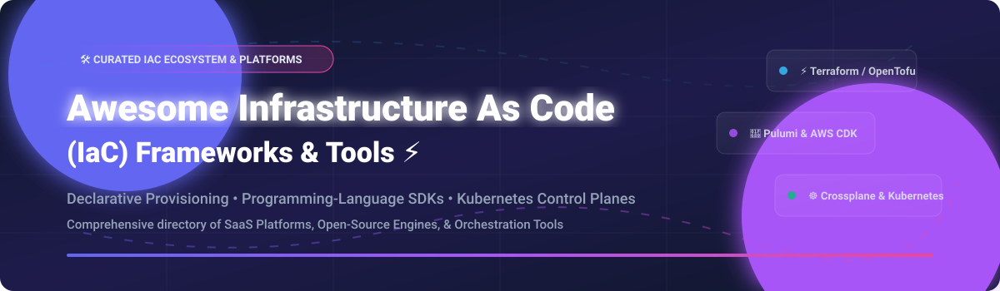

# ⚡ Awesome Infrastructure As Code (IaC) Frameworks & Tools

  

  
  
  
  

## 🚀 Overview & Ecosystem Directory

Welcome to the ultimate curated directory of **Infrastructure as Code (IaC) Frameworks**, **Cloud Provisioning Engines**, and **Automation Platforms**. Whether you are looking for declarative configuration tools (HCL, YAML), programming-language SDKs (TypeScript, Python, Go), serverless deployment frameworks, or Kubernetes-native control planes, this guide provides an exhaustive list of both commercial SaaS solutions and open-source GitHub repositories.

---

## 📑 Table of Contents

- [☁️ SaaS & Hosted IaC Platforms](#-saas--hosted-iac-platforms)
- [📦 Open-Source IaC Frameworks & Tools](#-open-source-iac-frameworks--tools)
- [🤝 How to Contribute](#-how-to-contribute)
- [💖 Support & Sponsorship](#-support--sponsorship)
- [⚠️ Disclaimer & Best Practices](#%EF%B8%8F-disclaimer--best-practices)
- [📊 Star History](#-star-history)

---

## ☁️ SaaS & Hosted IaC Platforms

### 📈 Market Size & Industry Dynamics

> [!NOTE]
> **Market Size & Structure**: The cloud infrastructure automation and IaC market is estimated at **$2.5B+ USD in 2026** and is growing at ~22% CAGR. The sector is **moderately fragmented**: **HashiCorp (HCP Terraform)** holds dominant market share in traditional declarative IaC governance following its $6.4B acquisition by IBM, while developer-focused alternatives (**Pulumi Cloud**) and orchestration platforms (**Spacelift**, **env0**, **Scalr**) compete actively for enterprise multi-IaC orchestration, self-service developer portals, and policy enforcement workloads.

### 📊 Hosted IaC Platform Comparison

*Sorted by Valuation / Company Revenue (Descending)*

| Product | Company Size / Valuation | Description & Key Strengths | Starting Pricing | Free Tier Limits |
| :--- | :--- | :--- | :--- | :--- |
| **[Terraform Cloud](https://www.terraform.io/cloud)** | **$6.4B Enterprise Value** *(IBM / HashiCorp)* | HashiCorp's managed IaC platform featuring remote state, collaboration, policy enforcement (Sentinel/OPA), and enterprise CI/CD integration. | **Essentials:** $0.10 per managed resource / month | **Free forever:** Up to 500 managed resources, unlimited users, 1 concurrent run + $500 HCP credit. |
| **[Pulumi Cloud](https://www.pulumi.com/)** | **$100M – $250M Est. Valuation** | Managed IaC platform supporting real programming languages (TypeScript, Python, Go, .NET, Java) with state management & ESC secret handling. | **Team:** $0.0005 per credit (~$0.37/resource/mo) | **Individual:** 1 user, unlimited resources. **Team Edition:** 150,000 free credits/mo (~200 resources for up to 10 users). |
| **[Spacelift](https://spacelift.io/)** | **$100M – $250M Est. Valuation** *(Series C $51M)* | Multi-IaC orchestration platform supporting Terraform, OpenTofu, Pulumi, CloudFormation, and Kubernetes with Policy-as-Code. | **Starter+:** $20,000 / year | **Free tier:** Up to 2 users, 1 public worker, unlimited runs. 14-day free trial (no credit card required). |
| **[env0](https://www.env0.com/)** | **$50M – $100M Est. Valuation** *($42M Total Raised)* | IaC automation platform enabling developer self-service environments with strict guardrails, drift detection, and cost control. | **Cloud Navigator:** Quote-based (~$1,500/mo flat starting enterprise rate) | **Free forever:** Up to 250 runs/mo, 30 active environments, 1 deployment concurrency, unlimited users & agents. |
| **[Scalr](https://scalr.com/)** | **$10M – $50M Est. Valuation** | Enterprise Terraform & OpenTofu management platform featuring hierarchical governance, OPA policies, and cost management. | **Pro / Usage-based:** $99/month (includes base runs; additional runs at $0.99/run) | **Free forever:** Up to 50 runs/month, unlimited users, workspaces, and managed resources, 5 default concurrent runs. |

---

## 📦 Open-Source IaC Frameworks & Tools

Below is a curated collection of open-source IaC frameworks, provisioning tools, and orchestration utilities.

*Sorted by GitHub Star Count (Descending)*

| Repository | GitHub Stars | License | Description & Primary Use Case |
| :--- | :--- | :--- | :--- |
| **[Terraform](https://github.com/hashicorp/terraform)** |  | BUSL-1.1 | **The de facto IaC standard** using HCL configuration syntax to provision cloud infrastructure across AWS, Azure, GCP, and 3,000+ providers. |
| **[Serverless Framework](https://github.com/serverless/serverless)** |  | MIT | **Pioneer serverless IaC framework** to build and deploy auto-scaling serverless applications on AWS Lambda, Azure Functions, and Google Cloud. |
| **[Ansible](https://github.com/ansible/ansible)** |  | GPL-3.0 | **Agentless IT automation, configuration management, and provisioning engine** utilizing YAML playbooks for server and cloud management. |
| **[OpenTofu](https://github.com/opentofu/opentofu)** |  | MPL-2.0 | **Open-source Terraform fork under Linux Foundation** providing a community-governed, drop-in replacement for HCL declarative provisioning. |
| **[Helm](https://github.com/helm/helm)** |  | Apache-2.0 | **The package manager for Kubernetes** allowing developers and operators to define, install, and upgrade complex Kubernetes applications using Charts. |
| **[Pulumi](https://github.com/pulumi/pulumi)** |  | Apache-2.0 | **Developer-centric IaC engine** enabling infrastructure definition using real programming languages (TypeScript, Python, Go, C#, Java). |
| **[SST](https://github.com/sst/sst)** |  | MIT | **TypeScript-first full-stack deployment framework** with live Lambda reload, zero-config AWS deployments, and modern app architecture patterns. |
| **[AWS Cloud Development Kit (CDK)](https://github.com/aws/aws-cdk)** |  | Apache-2.0 | **Software development framework for defining cloud infrastructure in code** (TypeScript, Python, Java, C#, Go) that synthesizes into CloudFormation templates. |
| **[Crossplane](https://github.com/crossplane/crossplane)** |  | Apache-2.0 | **Kubernetes-native control plane framework** that extends K8s Custom Resources (CRDs) to orchestrate cloud resources, databases, and services. |
| **[Terragrunt](https://github.com/gruntwork-io/terragrunt)** |  | MIT | **Thin wrapper for Terraform / OpenTofu** providing extra tools for keeping configurations DRY, working with multiple modules, and managing remote state. |
| **[Atlantis](https://github.com/runatlantis/atlantis)** |  | Apache-2.0 | **Terraform GitOps pull request automation tool** enabling teams to plan and apply Terraform changes directly via GitHub/GitLab PR comments. |
| **[Packer](https://github.com/hashicorp/packer)** |  | BUSL-1.1 | **Automated machine image builder** that creates identical machine images (AMIs, Docker images, VMDKs) for multiple platforms from a single configuration. |
| **[AWS SAM](https://github.com/aws/serverless-application-model)** |  | Apache-2.0 | **AWS Serverless Application Model CLI & engine** for building, testing, and deploying serverless applications defined by shorthand CloudFormation templates. |
| **[Checkov](https://github.com/bridgecrewio/checkov)** |  | Apache-2.0 | **Static code analysis tool for infrastructure as code** scanning Terraform, CloudFormation, Helm, Kubernetes, and ARM templates for security misconfigurations. |
| **[Terramate](https://github.com/terramate-io/terramate)** |  | MPL-2.0 | **Infrastructure orchestration and code generation engine** for managing large-scale Terraform and OpenTofu monorepos with parallel execution and change detection. |
| **[Infracost](https://github.com/infracost/infracost)** |  | Apache-2.0 | **Cloud cost estimates for Terraform** in pull requests, allowing developers to see cost breakdowns before launching infrastructure. |
| **[CDK for Terraform (CDKTF)](https://github.com/hashicorp/terraform-cdk)** |  | MPL-2.0 | **Define Terraform infrastructure using programming languages** (TypeScript, Python, Java, C#, Go) synthesizing into HCL configuration files. |
| **[Troposphere](https://github.com/cloudtools/troposphere)** |  | BSD-2-Clause | **Python library to create AWS CloudFormation descriptions** with type checking, code generation, and standard Python control structures. |

---

## 🤝 How to Contribute

Contributions are welcome! Please follow these simple guidelines:

1. 🍴 **Fork** this repository.
2. 📝 **Add or update** entries in `README.md` maintaining the existing table layouts and badge formats.
3. 🔎 **Verify** all facts, star badges, and links to official documentation or GitHub repositories.
4. 🚀 **Open a Pull Request** with a clear title and concise summary of your changes.

---

## 💖 Support & Sponsorship

If you find this repository helpful for your cloud engineering, platform architecture, or DevOps journey, please consider supporting the project:

- ⭐ **Star this repository** to help others discover it!
- 🔀 **Fork & Share** with your colleagues and community.
- ☕ **Buy Me a Coffee / Sponsor**: Support ongoing maintenance via the [GitHub Sponsor Dashboard](https://github.com/sponsors/ishandutta2007).

Thank you for being part of the open-source DevOps and IaC community! ❤️

---

## ⚠️ Disclaimer & Best Practices

- **Community Curated**: This repository is a community-driven overview and does not constitute official endorsement.
- **State Security**: IaC state files contain sensitive data (passwords, private keys, secrets). Always use encrypted remote state backends (AWS S3 with DynamoDB locking, GCP GCS, Azure Blob, or managed SaaS state) and never commit state files to source control.
- **Licensing Compliance**: Always audit tool licenses (e.g., BUSL vs. MPL-2.0 vs. Apache-2.0) against your organization's legal policies before adopting.
- **Security Scanning**: Implement static security scanners like **Checkov**, **Trivy**, or **tfsec** in your CI/CD pipelines to catch vulnerabilities prior to deployment.

---

## 📊 Star History

---

  <b>Made with ❤️ for Platform Engineers, DevOps Practitioners, and Cloud Architects worldwide.</b>

